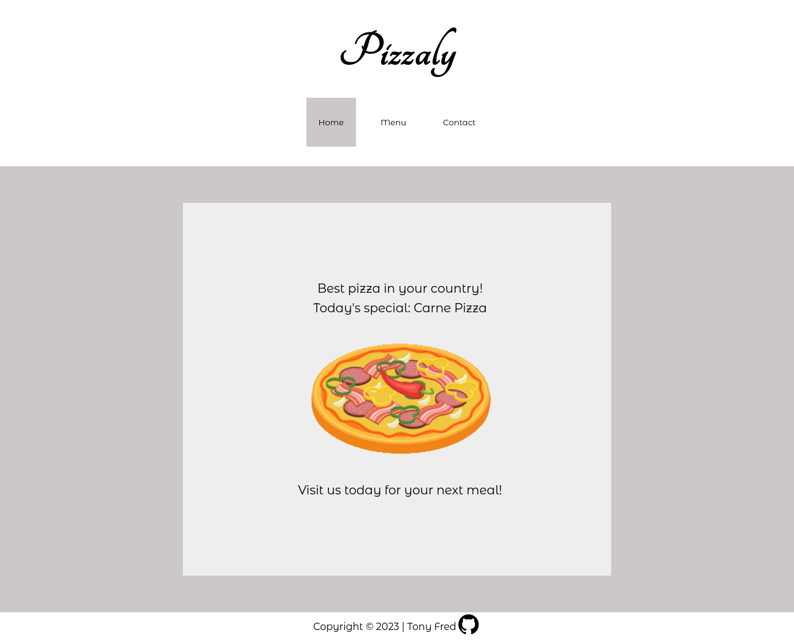

# A Restaurant Page: Pizzaly

This was created as a project in the [JavaScript Path of The Odin Project](https://www.theodinproject.com/lessons/node-path-javascript-restaurant-page)

## Table of Contents

- [Demo](#demo)
- [Build With](#built-with)
- [Contributing](#contributing)
- [License](#license)
- [Acknowledgments](#acknowledgments)

## Demo

You can demo it live at [Pizzaly Demo](https://tonyfred-code.github.io/project-resturant-page/).

## Built With

- Vanilla JS
- HTML5
- CSS3

## Contributing

Contributions are welcome! If you'd like to contribute to this project, please follow these guidelines:

1. Fork the repository.
2. Create a new branch for your feature or bug fix.
3. Make your changes and commit them.
4. Push your changes to your fork.
5. Create a pull request.

## License

This project is licensed under the [MIT LICENSE](./LICENSE)

## Acknowledgments

Images of Pizza taken from a [project solution](https://michalosman.github.io/restaurant-page/) on odin project page by [Michalosman](https://github.com/michalosman/restaurant-page).
Design of Pizzaly inspired by same project.
